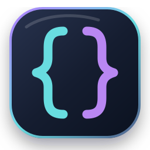
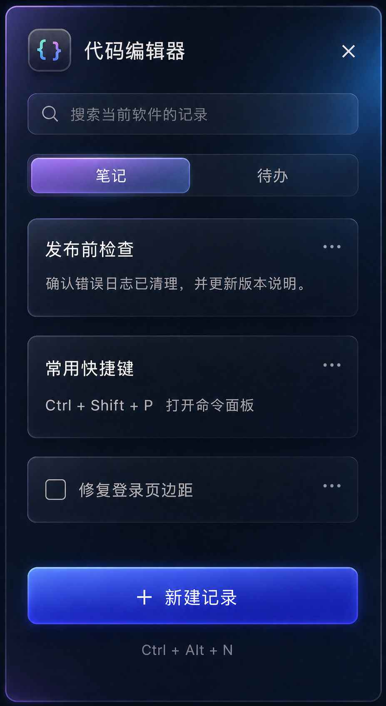

<div align="center">
  
  <h1>MemoDock</h1>
  <p>为每个 Windows 软件准备一份独立的本地备忘录。</p>
  <p><strong>Windows 11 · WPF · .NET 10 · Local-first</strong></p>
  <p>
    <a href="./LICENSE"></a>
    
    
  </p>
  <p>
    <strong>简体中文</strong> · <a href="./README.en.md">English</a>
  </p>
</div>

MemoDock 会识别打开前最后处于前台的软件，并自动切换到该软件独立的笔记和待办。记录保存在本机，不需要账户或网络。

> 当前版本：`0.4.0`（[下载](https://github.com/LittleBeeY/memodock/releases/tag/v0.4.0)）

<p align="center">
  
</p>

## 功能

- 按软件身份隔离记录；商店应用升级后仍能关联原有笔记
- 自动跟随前台软件，也可关闭自动跟随后从已有软件中手动切换
- 点击任务栏或桌面时保持当前软件不变
- 笔记和待办两种记录类型
- 当前软件内搜索、新建、编辑和删除；搜索支持多个关键词
- 跨软件全局搜索，结果标注所属软件
- 回收站：删除后可从回收站恢复，或彻底删除
- 待办完成状态，未完成项优先显示
- 全局快捷键（默认 `Ctrl + Alt + N`，可在设置中自定义）；窗口内 `Ctrl + N` 新建、`Ctrl + F` 搜索
- 事件驱动的前台软件跟随（WinEvent 即时感知，轮询兜底）
- 单实例运行，重复启动只唤醒已有窗口
- 窗口拖动、缩放及大小和位置记忆；首次停靠跟随前台软件所在显示器
- 开机自动启动（设置中开关）
- 关闭到系统托盘，托盘菜单可导出数据备份、打开设置
- Windows 11 Desktop Acrylic、圆角和深色界面
- 覆盖前滚动保留两级历史备份，主文件损坏时自动回退更早备份
- 无账户、无遥测、无云端依赖

## 快速开始

### 运行源码

需要：

- Windows 11
- [.NET 10 SDK](https://dotnet.microsoft.com/download/dotnet/10.0)

```powershell
dotnet run --project .\src\MemoDock\MemoDock.csproj
```

### 使用方式

1. 保持 MemoDock 在后台运行。
2. 切换到需要记录的软件。
3. 按 `Ctrl + Alt + N`，或双击托盘图标打开 MemoDock。
4. 选择“笔记”或“待办”，添加当前软件的记录。
5. 点击顶部软件名称可以手动切换；关闭“自动”后会锁定当前软件。
6. 关闭按钮和 `Esc` 只会隐藏窗口；托盘菜单“退出”才会结束程序。
7. 需要额外备份时，在托盘菜单选择“导出数据备份…”。

快捷键只负责显示窗口，不会自动打开新建记录窗口。

## 数据与隐私

MemoDock 不会上传记录，也不依赖网络服务。数据默认保存在：

| 文件 | 用途 |
| --- | --- |
| `%LOCALAPPDATA%\MemoDock\memos.json` | 当前笔记和待办 |
| `%LOCALAPPDATA%\MemoDock\memos.json.bak` | 覆盖前的上一版数据 |
| `%LOCALAPPDATA%\MemoDock\memos.json.bak.1` | 更早一版的历史数据 |
| `%LOCALAPPDATA%\MemoDock\window.json` | 窗口大小和位置 |

保存时会先写临时文件，再替换正式文件，并滚动保留两级历史备份。如果主 JSON 损坏，原文件会改名保留，并依次尝试恢复 `.bak`、`.bak.1`。
旧版数据会在加载时自动迁移：普通桌面程序仍按完整 EXE 路径区分，Windows 商店应用使用不含版本号的稳定身份，并自动合并升级前后的记录。迁移覆盖前同样会生成 `.bak`。

> “本地私有”表示数据不离开当前电脑；记录目前以明文 JSON 保存，不等同于加密存储。

## 开发

### 构建与测试

```powershell
dotnet restore .\MemoDock.sln --configfile .\NuGet.Config
dotnet build .\MemoDock.sln --configuration Release --no-restore
dotnet run --project .\tests\MemoDock.CoreTests\MemoDock.CoreTests.csproj --configuration Release --no-restore
```

当前自测覆盖：

- 不同软件的记录隔离和持久化
- 标题和正文搜索、多关键词搜索
- 跨软件全局搜索
- 软删除、回收站与恢复
- 待办排序（未完成项优先）
- 损坏数据恢复上一版、主文件缺失时从备份恢复（且恢复数据同样迁移到当前版本）、滚动备份两级历史与回退、全部备份损坏时回退空库、超大文件视为损坏
- 合并冲突记录按更新时间取新
- 旧数据迁移补全创建时间、重复迁移幂等
- 设置持久化往返与损坏回退默认值
- 保存时保留上一版备份、导出数据副本
- 商店应用升级后的稳定识别和旧记录迁移

### 发布

发布脚本会自动读取 `Directory.Build.props` 中的版本号，无需手工维护：

```powershell
# 框架依赖多文件版（默认），分享时必须发送整个发布目录
.\scripts\publish.ps1

# 自包含单文件版（win-x64），无需预装 .NET
.\scripts\publish.ps1 -SelfContained

# 自包含单文件版（ARM64）
.\scripts\publish.ps1 -SelfContained -Runtime win-arm64
```

输出到 `.\artifacts\`。自包含版启用了 ReadyToRun 预编译加快启动，并用 Brotli 压缩整个单文件包（体积约降至 1/3，原生库在内存中解压加载）；与处理器架构绑定；因托盘图标依赖 WinForms，不启用代码裁剪。

仓库的 `NuGet.Config` 刻意不配置远程包源；自包含发布时脚本会临时使用官方 NuGet 源获取运行时包。

## 工程结构

```text
src/
  MemoDock.Core/       数据模型、查询、迁移和本地存储（平台无关）
    Models/            备忘录、记录本、记录等模型
    Services/          MemoRepository、MemoQuery、MemoMigrator、AppIdentity 等
  MemoDock/            WPF 界面与 Windows 集成
    Assets/            应用图标源文件和 ICO
    Services/          前台识别、快捷键、单实例、窗口效果和菜单构建
tests/
  MemoDock.CoreTests/  无第三方测试框架的核心逻辑自测
scripts/
  publish.ps1          一键发布脚本（框架依赖 / 自包含）
output/imagegen/       已确认的界面视觉基准
Directory.Build.props  统一项目版本号
```

## 当前限制

- 同一程序的不同工作区暂时共用一份记录。
- 少数使用系统进程包装器、且无法取得实际 EXE 路径的应用可能显示不准确。
- 尚未制作 MSIX 安装包和代码签名。

## 贡献

欢迎提交 Issue 和 Pull Request。请先阅读 [贡献指南](./CONTRIBUTING.md)：

- Bug 或功能建议 → 新建 [Issue](../../issues/new/choose)
- 修改代码 → Fork 后提交 [Pull Request](../../pulls)
- 安全漏洞 → 按 [SECURITY.md](./SECURITY.md) 走私密渠道

## 许可证

[Apache License 2.0](./LICENSE) © 2026 MemoDock contributors

本项目的记录以明文 JSON 保存，属于"本地私有"而非加密存储；请勿把敏感凭据写入记录。
